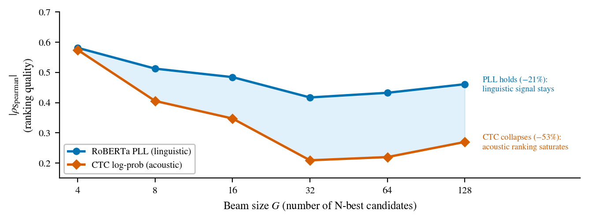

# RBPO — The Anatomy of the CTC Oracle Gap

**Where is the bottleneck in near-converged CTC speech recognition — the acoustics, or the language?**
This repository shows it is *linguistic*: eleven CTC-internal scorers cannot beat greedy decoding,
but **MBR decoding with a RoBERTa pseudo-log-likelihood posterior** recovers a **9.0 % relative WER
reduction** on held-out LibriSpeech `test-other` — without touching the acoustic model.

<p align="center"></p>

<p align="center">
  
  
  
  
</p>

> RBPO is the project codename (the URL is cited in the paper); read it as the project name, not an
> acronym to expand. This started as a Bachelor's research project at HSE University and is released
> here as a **CV-facing preprint** plus a reproducible code/data repository.

📄 **Preprint:** [`paper/paper.pdf`](paper/paper.pdf) · build it with `cd paper && ./build.sh` (pdfLaTeX).

---

## TL;DR

A frozen, near-converged CTC acoustic model leaves a large **oracle gap** — better transcripts already
exist in its N-best list (dev-other: greedy 6.02 %, oracle 3.53 % at *G*=128). We ask whether that gap
can be closed by **training** the model (sequence-level fine-tuning) or by **decoding** (smarter
selection over a fixed N-best). The answer localizes the bottleneck:

- **Training side — negative, by design.** A 2×2 of {CR-CTC, standard-CTC} × {MWER, RAFT} produces no
  improvement; the failures are **planned diagnostic boundary conditions** that pin down *when*
  sequence-level fine-tuning at a near-converged checkpoint can work (it needs a non-negligible
  training oracle gap *and* a flat-enough loss basin — no tested model has both).
- **Decoding side — the breakthrough.** Eleven CTC-internal / acoustic-feature scorers are exhausted
  (none significant at *G*=16). Adding **external linguistic** evidence via **MBR + RoBERTa PLL**
  breaks through: **−0.54 pp on test-other (9.0 % relative)**, significant in **11 of 13** conditions
  across two architectures, three domains, and four noise levels — with **zero per-condition tuning**.
- **Theory.** The CTC backward pass is *identified* as the **Rao-Blackwellized REINFORCE** estimator at
  the output projection (variance 2.96× below Viterbi, **numerically verified** on 250 utterances).

The mechanism behind it all (teaser above): as the candidate set grows, **CTC ranking quality
collapses** (−53 %) under blank-path proliferation while **PLL stays informative** (−21 %). That
divergence is why MBR keeps improving with beam size while score-interpolation plateaus.

---

## Key results

Zipformer-S CR-CTC (BPE-500, 22.1 M params), MBR-CER + RoBERTa-base PLL (τ=10), vs greedy.
Full numbers and CIs in the [paper](paper/paper.pdf); cross-condition table in §6 / Appendix A.

| Condition (held-out unless noted) |  *G* | Greedy | **MBR+PLL** | Oracle |   Δ (pp) |        *p* |
|-----------------------------------|-----:|-------:|------------:|-------:|---------:|-----------:|
| LibriSpeech **test-other**        |  128 |   5.96 |    **5.42** |   3.37 | **−0.54** |    <0.0001 |
| LibriSpeech test-other            |   16 |   5.96 |        5.77 |   4.41 |    −0.19 |     0.0003 |
| LibriSpeech dev-other             |  128 |   6.02 |        5.53 |   3.53 |    −0.49 |    <0.0001 |
| Zipformer-M (65 M)                |  128 |   4.78 |        4.43 |   2.73 |    −0.34 |    <0.0001 |
| TED-LIUM 3 (out-of-domain)        |  128 |  11.30 |       10.57 |   7.51 |    −0.73 |    <0.0001 |
| MUSAN 5 dB (additive noise)       |   16 |  11.10 |       10.84 |   9.06 |    −0.27 |      0.001 |

**11 of 13 conditions** reach significance. The two that do not are *predicted in advance*: VoxPopuli
(coverage-bottlenecked — 91.5 % of utterances already greedy-optimal) and MUSAN 0 dB (candidate
quality collapses under extreme noise).

---

## Method, in one breath

```
audio ─► CTC acoustic model (frozen)
        └─► k2 lattice sampling (nbest_scale=1.0) ─► G-best candidates
                                                    │
                       RoBERTa pseudo-log-likelihood┤ scores each candidate as English text
                                                    ▼
        MBR-CER: pick argmin_y  Σ_j  softmax(PLL_j / τ) · CER(y, y_j)
                                                    ▼
                                         selected transcript
```

MBR aggregates *consensus* over the candidate set rather than committing to a single argmax, which is
why it keeps gaining as the beam grows (the PLL posterior stays informative where CTC scores do not).

---

## Repository structure

```
paper/            De-branded ICML-style preprint (pdfLaTeX). Self-contained, arXiv-ready.
  paper.tex         Main source · build.sh · icml2025.{sty,bst} (+ forloop shim)
  sections/         Abstract, §1–§7, Appendices A–C
  figures/          Publication figures (vector PDF, regenerated by scripts/generate_figures.py)
scripts/          Pipeline: generate_nbest, score_pll, rerank_mbr, generate_figures, …
experiments/      Per-stage drivers:
  training/         MWER, RAFT, reranker + value-head training, N-best generation
  decoding/         MBR, shallow fusion, neural-LM scoring, beam/temperature sweeps, MC-dropout
  evaluation/       dev/test evaluation
  analysis/         γ_t analysis, gradient-variance (RB/Viterbi/sampled), oracle WER, plotting
  robustness/       cross-domain / noise verification
  data_prep/        corpus preparation (LibriSpeech, TED-LIUM 3, MUSAN, …)
rbpo/             Installable package: shared utils, training logic, tests
results/          Figure-backing data + reports (small files tracked; large JSONLs on Drive — see below)
notebooks/        Colab session notes / troubleshooting (see notebooks/README.md)
NOTES_FOR_AUTHOR.md  Reformat decisions + open items
```

---

## Install

Python 3.11.

```bash
pip install -r requirements.txt        # core scoring/analysis/figure deps
pip install -e .                       # the rbpo package (optional)
```

**N-best *generation*** additionally needs [k2](https://github.com/k2-fsa/k2),
[icefall](https://github.com/k2-fsa/icefall), and [lhotse](https://github.com/lhotse-speech/lhotse),
which are **not pip-installable** — clone icefall and add it to `PYTHONPATH`. Reranking, analysis, and
figure regeneration run **without** k2 from the data already in `results/`.

---

## Reproduce

**Figures** (fully local, no GPU, no Drive data — uses the CSV/JSON already in `results/`):

```bash
python scripts/generate_figures.py      # writes vector PDFs to paper/figures/
# or: bash scripts/reproduce_figures.sh
```

**The decoding pipeline** (needs the N-best JSONLs — see *Data availability*):

```bash
python scripts/generate_nbest.py  --cuts cuts.jsonl.gz --checkpoint pretrained.pt \
                                  --bpe bpe.model --G 128 --output nbest.jsonl
python scripts/score_pll.py       --nbest nbest.jsonl --output nbest_pll.jsonl --model roberta-base
python scripts/rerank_mbr.py      --nbest nbest_pll.jsonl --output mbr.json \
                                  --utility cer --tau 10.0
```

---

## Data availability

Small figure-backing data (oracle/Spearman curves, MWER trajectories, bootstrap summaries) is tracked
in `results/` — see [`results/MANIFEST.md`](results/MANIFEST.md). The **large N-best and PLL JSONLs**
(100 MB+ each) are kept out of git and live on Google Drive:

> **Google Drive:** _link to be added by the author_ — see `NOTES_FOR_AUTHOR.md`.

---

## Citation

```bibtex
@misc{novosad2026ctcoraclegap,
  title         = {The Anatomy of the CTC Oracle Gap: Acoustic Exhaustion and Linguistic Recovery},
  author        = {Novosad, Ivan},
  year          = {2026},
  note          = {Preprint},
  howpublished  = {\url{https://github.com/Melodiz/RBPO}}
}
```

A machine-readable [`CITATION.cff`](CITATION.cff) is also provided.

---

## License

- **Code** (`scripts/`, `experiments/`, `rbpo/`, figure-generation): [MIT](LICENSE).
- **Paper and figures** (`paper/`): [CC-BY-4.0](paper/LICENSE).

## Acknowledgements

Supervised by **Peter Lukianchenko** (Faculty of Computer Science, HSE University). The problem
originated in a production CTC-ASR setting encountered during an industry internship.
