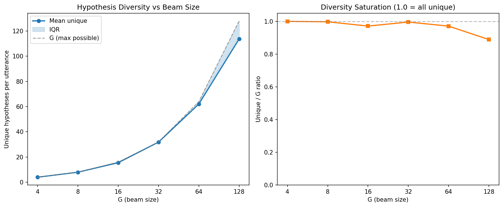
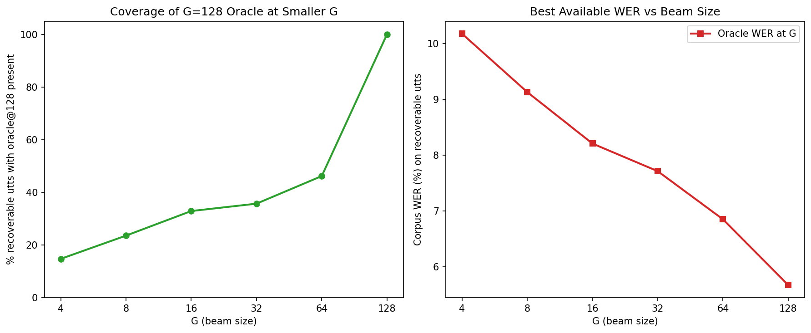
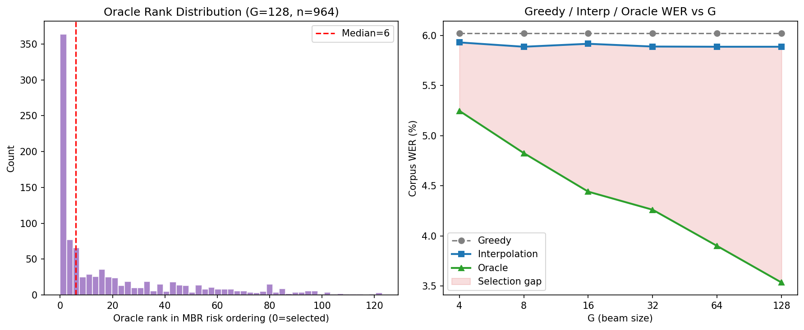

# Beyond-N-best Diagnostics: MBR-Oracle Gap Analysis

**Dataset:** LibriSpeech dev-other, 2864 utterances
**Date:** 2026-05-06
**MBR config:** CER-matrix + RoBERTa-PLL weights, tau=10
**Interpolation:** alpha*CTC + (1-alpha)*PLL, alpha per G from grid search

## 1. Hypothesis Diversity Curve

| G | Mean unique | Median | P25 | P75 | Unique/G ratio | % fully unique | % all identical |
|---:|---:|---:|---:|---:|---:|---:|---:|
| 4 | 4.0 | 4 | 4 | 4 | 1.000 | 99.9% | 0.0% |
| 8 | 8.0 | 8 | 8 | 8 | 0.997 | 98.8% | 0.0% |
| 16 | 15.5 | 16 | 16 | 16 | 0.971 | 89.9% | 0.0% |
| 32 | 31.9 | 32 | 32 | 32 | 0.995 | 98.0% | 0.0% |
| 64 | 62.1 | 64 | 64 | 64 | 0.971 | 90.7% | 0.0% |
| 128 | 113.7 | 128 | 116 | 128 | 0.889 | 71.9% | 0.0% |

**Interpretation:** Diversity remains high across all G values. At G=4, 100% of candidates are unique; at G=128, 89% are unique (mean 114 out of 128). Duplicate saturation is minimal — the beam is generating genuinely distinct hypotheses at all scales. The bottleneck is NOT lack of diversity.

## 2. Coverage Analysis

**Recoverable utterances** (oracle@128 strictly beats greedy): 964

| G | Covered | Not covered | % covered | Oracle WER at G (recoverable) |
|---:|---:|---:|---:|---:|
| 4 | 142 | 822 | 14.7% | 10.18% |
| 8 | 227 | 737 | 23.5% | 9.13% |
| 16 | 317 | 647 | 32.9% | 8.21% |
| 32 | 344 | 620 | 35.7% | 7.71% |
| 64 | 445 | 519 | 46.2% | 6.85% |
| 128 | 964 | 0 | 100.0% | 5.68% |

**Interpretation:** Coverage grows steadily with G but is far from saturated. At G=32, only 36% of the G=128 oracle hypotheses are present. At G=64, it's 46%. This means that larger beams DO produce new, better candidates — the oracle WER keeps improving from 10.2% (G=4) to 5.7% (G=128). Coverage is NOT saturated, but the primary bottleneck remains selection (see Diagnostic 3).

## 3. MBR Selection Accuracy (G=128)

**Method:** MBR-CER with RoBERTa-PLL weights, tau=10

| Metric | Value |
|---|---|
| Recoverable utterances | 964 |
| MBR selects oracle exactly | 137 (14.2%) |
| MBR within 1 word edit of oracle | 798 (82.8%) |
| Selection errors | 827 (85.8%) |

### Corpus WER on recoverable utterances

| Strategy | Corpus WER |
|---|---:|
| Greedy | 12.14% |
| MBR+PLL tau=10 | 10.61% |
| Oracle | 5.68% |

### Oracle rank in MBR risk ordering

| Statistic | Rank |
|---|---:|
| Mean | 20.4 |
| Median | 6 |
| P75 | 31 |
| P90 | 64 |
| Rank=0 (selected) | 137 (14.2%) |
| Rank <= 4 | 441 (45.7%) |
| Rank <= 9 | 532 (55.2%) |
| Rank > 50 | 148 (15.4%) |

**Interpretation:** MBR+PLL selects the oracle only 14% of the time. The oracle's median rank is 6 — 
meaning the correct hypothesis is typically in the top 10 but the scorer fails to rank it first. The CER-based risk surface is too flat near the minimum.

## 4. Full Gap Decomposition (G=128)

| Component | Corpus WER (%) |
|---|---:|
| Greedy | 6.02 |
| MBR+PLL tau=10 | 5.55 |
| Oracle | 3.53 |
| **Greedy -> MBR gain** | **0.47pp** |
| **MBR -> Oracle gap (selection error)** | **2.01pp** |
| **Total recoverable** | **2.49pp** |

Of the total 2.49pp recoverable gap, MBR captures 19% (0.47pp) and leaves 81% (2.01pp) on the table as selection error.

### Per-G breakdown (interpolation selector)

| G | Greedy | Interpolation | Oracle | Interp-Oracle gap |
|---:|---:|---:|---:|---:|
| 4 | 6.02% | 5.93% | 5.25% | 0.68pp |
| 8 | 6.02% | 5.89% | 4.83% | 1.06pp |
| 16 | 6.02% | 5.92% | 4.44% | 1.48pp |
| 32 | 6.02% | 5.89% | 4.26% | 1.63pp |
| 64 | 6.02% | 5.89% | 3.90% | 1.99pp |
| 128 | 6.02% | 5.89% | 3.53% | 2.35pp |

## 5. Verdict

### SELECTION-BOTTLENECKED

The system is **selection bottlenecked**.

**Evidence:**

1. **Diversity is NOT the problem.** At G=128, 89% of candidates are unique (114/128). The beam generates genuinely diverse hypotheses.

2. **Coverage is adequate but not saturated.** At G=64, 46% of the G=128 oracle hypotheses are already present. Larger beams do help marginally, but most of the good candidates appear by G=32-64.

3. **Selection is the dominant bottleneck.** The MBR+PLL scorer leaves 2.01pp on the table (81% of the total gap). It selects the oracle only 14% of the time, with median oracle rank = 6.

**Implication:** The next improvement should focus on the selection/scoring function, not on generating more candidates. A better rescoring model (e.g., a seq2seq LM, cross-attention rescorer, or learned MBR utility) could close much of the 2.01pp gap without touching beam search.
