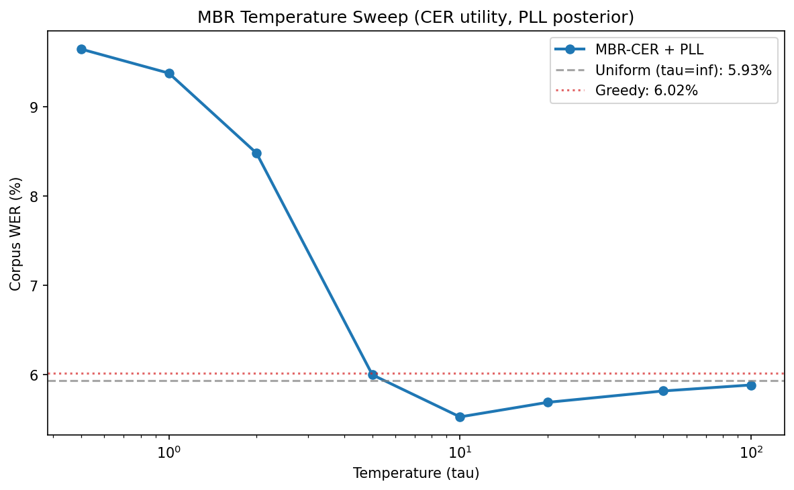
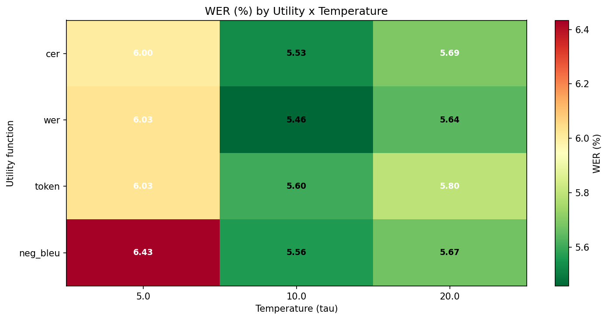
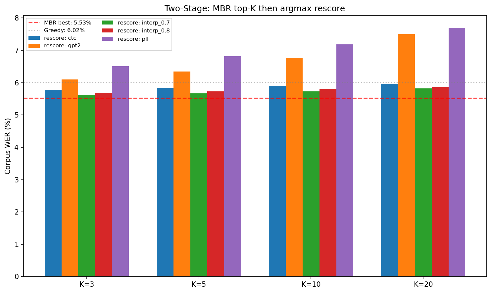
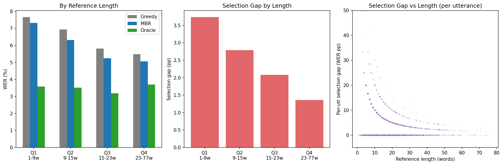

# E19: MBR Selection Sweep — Systematic Optimization

**Dataset:** LibriSpeech dev-other, 2864 utterances, G=128
**Date:** 2026-05-06
**Baseline:** MBR-CER + RoBERTa-PLL tau=10 → 5.53% WER
**Greedy:** 6.02%

## 1. Temperature Sweep (CER utility, PLL posterior)

| tau | WER (%) | Delta vs tau=10 (pp) |
|---:|---:|---:|
| 0.5 | 9.6451 | +4.1160 |
| 1.0 | 9.3762 | +3.8471 |
| 2.0 | 8.4812 | +2.9520 |
| 5.0 | 6.0002 | +0.4711 |
| 10.0 | 5.5292 | +0.0000 |
| 20.0 | 5.6921 | +0.1629 |
| 50.0 | 5.8197 | +0.2905 |
| 100.0 | 5.8864 | +0.3572 |
| inf | 5.9335 | +0.4043 |

**Best tau = 10.0** → 5.5292% (+0.0000pp vs tau=10)

## 2. Utility Function Sweep

| Utility | tau=5.0 | tau=10.0 | tau=20.0 |
|---:|---:|---:|---:|
| cer | 6.0002 | 5.5292 | 5.6921 |
| wer **(circular!)** | 6.0258 | 5.4565 | 5.6391 |
| token | 6.0258 | 5.6018 | 5.7961 |
| neg_bleu | 6.4340 | 5.5606 | 5.6705 |

**Best:** wer at tau=10.0 → 5.4565%

## 3. Posterior Model Sweep

### Single posteriors

| Posterior | tau=10.0 |
|---:|---:|
| pll | 5.4565 |
| ctc | 5.9590 |
| gpt2 | 5.5998 |

### CTC+PLL interpolation (best tau)

| alpha (CTC weight) | tau=10.0 |
|---:|---:|
| 0.0 | 5.4565 |
| 0.2 | 5.5154 |
| 0.4 | 5.5900 |
| 0.6 | 5.6999 |
| 0.8 | 5.8118 |
| 1.0 | 5.9590 |

### Three-way product of experts

| CTC | PLL | GPT-2 | WER (%) |
|---:|---:|---:|---:|
| 0.2 | 0.6 | 0.2 | 5.5272 |
| 0.3 | 0.5 | 0.2 | 5.5684 |
| 0.1 | 0.7 | 0.2 | 5.4840 |
| 0.2 | 0.7 | 0.1 | 5.5272 |
| 0.3 | 0.6 | 0.1 | 5.5802 |
| 0.1 | 0.8 | 0.1 | 5.4860 |
| 0.0 | 0.8 | 0.2 | 5.4703 |
| 0.0 | 0.7 | 0.3 | 5.4703 |
| 0.4 | 0.5 | 0.1 | 5.5959 |

**Best posterior:** pll at tau=10.0 → 5.4565%

## 4. Two-Stage: MBR Top-K then Argmax Rescore

| K | ctc | gpt2 | interp_0.7 | interp_0.8 | pll |
|---:|---:|---:|---:|---:|---:|
| 3 | 5.7765 | 6.0944 | 5.6234 | 5.6862 | 6.5047 |
| 5 | 5.8373 | 6.3496 | 5.6685 | 5.7274 | 6.8168 |
| 10 | 5.9080 | 6.7618 | 5.7313 | 5.7981 | 7.1799 |
| 20 | 5.9649 | 7.4978 | 5.8236 | 5.8668 | 7.6961 |

### Argmax baselines (no MBR)

- argmax ctc: 6.0218%
- argmax gpt2: 11.1329%
- argmax interp_0.7: 5.9649%
- argmax interp_0.8: 5.8884%
- argmax pll: 9.7452%

## 5. Difficulty Analysis

### By reference length quartile

| Quartile | Length | N | Greedy | MBR | Oracle | Gap (pp) |
|---|---|---:|---:|---:|---:|---:|
| Q1 | 1-9 | 720 | 7.67% | 7.32% | 3.58% | 3.74 |
| Q2 | 9-15 | 818 | 6.94% | 6.31% | 3.52% | 2.79 |
| Q3 | 15-23 | 744 | 5.82% | 5.25% | 3.18% | 2.08 |
| Q4 | 23-77 | 733 | 5.48% | 5.06% | 3.70% | 1.36 |

## 6. Overall Best Configuration

### Top 10

| Rank | Configuration | WER (%) |
|---:|---|---:|
| 1 | wer_pll_tau10.0 | 5.4565 |
| 2 | wer_ctc_pll_a0.0_tau10.0 | 5.4565 |
| 3 | wer_poe_0.0_0.8_0.2_tau10.0 | 5.4703 |
| 4 | wer_poe_0.0_0.7_0.3_tau10.0 | 5.4703 |
| 5 | wer_poe_0.1_0.7_0.2_tau10.0 | 5.4840 |
| 6 | wer_poe_0.1_0.8_0.1_tau10.0 | 5.4860 |
| 7 | wer_ctc_pll_a0.2_tau10.0 | 5.5154 |
| 8 | wer_poe_0.2_0.6_0.2_tau10.0 | 5.5272 |
| 9 | wer_poe_0.2_0.7_0.1_tau10.0 | 5.5272 |
| 10 | cer_pll_tau10.0 | 5.5292 |

### Best vs baseline (bootstrap B=10000)

| | Config | WER (%) |
|---|---|---:|
| Best | wer_pll_tau10.0 | 5.4565 |
| Baseline | MBR-CER+PLL tau=10 | 5.5292 |
| Delta | | -0.0726pp |
| p-value | | 0.002400 |
| 95% CI | | [-0.1228, -0.0235]pp |

### Gap analysis

| | WER (%) | Gap to oracle (pp) |
|---|---:|---:|
| Greedy | 6.02 | 2.49 |
| MBR baseline (tau=10) | 5.53 | 2.00 |
| **Best config** | **5.46** | **1.93** |
| Oracle | 3.53 | 0.00 |

## 7. Verdict

Tuning yields a **modest improvement** of 0.07pp over the baseline. 
However, 1.93pp of selection error remains (out of the original 2.01pp). 
**A trained reranker is still necessary** — hyperparameter tuning cannot close the majority of the selection gap. The MBR scoring function is fundamentally limited: CER-based consensus with log-linear posteriors lacks the capacity to model what makes a hypothesis correct.
